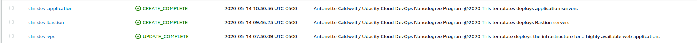
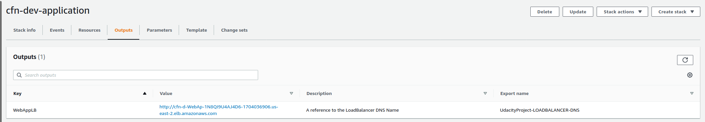
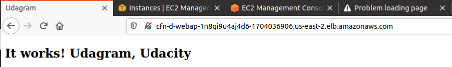

# CloudFormation Project

## Objective

> This project is to fulfill the project named "Deploy a high-availability web app using CloudFormation" on Udacity Cloud DevOps Nanodegree.

The project is based on a tool called Sceptre and also using Troposphere. I found that using this tool is easier than creating from scratch.

However, if you want to see a work in progress project that has the original files, please see [https://github.com/pullmana8/Cloudformation-IaC](https://github.com/pullmana8/Cloudformation-IaC).

## Requirements

If you would like to try out the tool Sceptre, you will need to install Sceptre through pip. Once installed, setup the virtual environment within your newly created project.

For my python packing and virtual environment, I use pipx and pipenv.

Install pipx with sceptre and pipenv.

`sceptre new project my-sceptre-project`

You will be ask to input region and name of the project which be put into a config.yaml file.

Once the project is created, change into the directory and run pipenv install sceptre for double measure. This will create the Pipfile and Pipfile.lock.

I ran `python freeze > requirements.txt` so you can see what was been used in this project.

In order to run the commands to setup the network infrastructure, the bastions, and the app servers, please use the below.

```bash
sceptre create dev/vpc.yaml
sceptre create dev/bastion.yaml
sceptre create dev/application.yaml
```

## Note

Please note that the variables are being used in the folder config/dev, while the templates folder contain the CloudFormation template.

Some of the variables ask for certain that you may not have. You will need to create the s3 bucket for the application, the key pair for the bastion instances, and the s3 bucket for the keys.

Noted, it is not the secure way to store, but it works for the time being. 

## Screenshots

Here are the screenshots below.

The first is when the stacks are successfully created.



The second is the name of the url to go when accessing the site.



The third is the site loading where it says, 'It Works! Udagram, Udacity'

